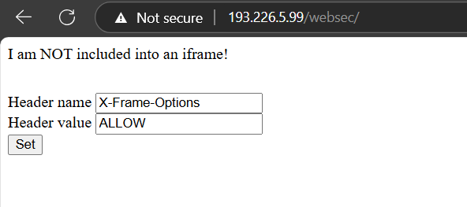
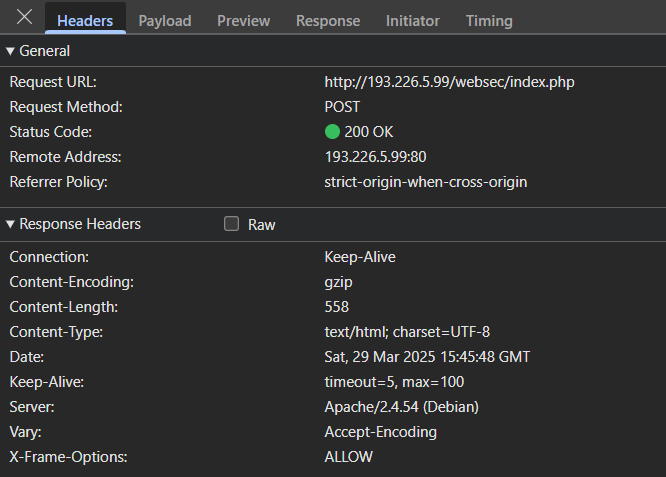
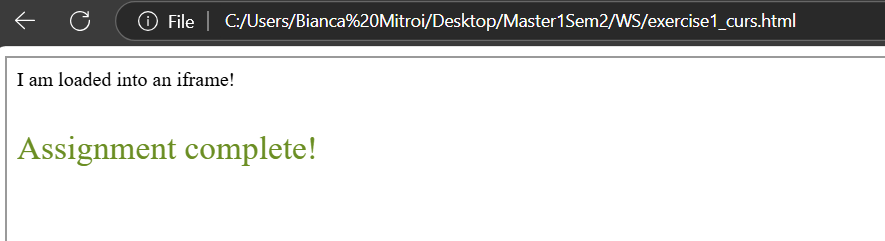

# Header injection

## Page for setting the headers






## Code of the page
``` 
<!DOCTYPE html>
    <body>
        <iframe src="http://193.226.5.99/websec/index.php?hName=X-Frame-Options&hValue=ALLOW" height="500px" width="1000px">
        </iframe>
    </body>
</html>
```

## The result of the local page


