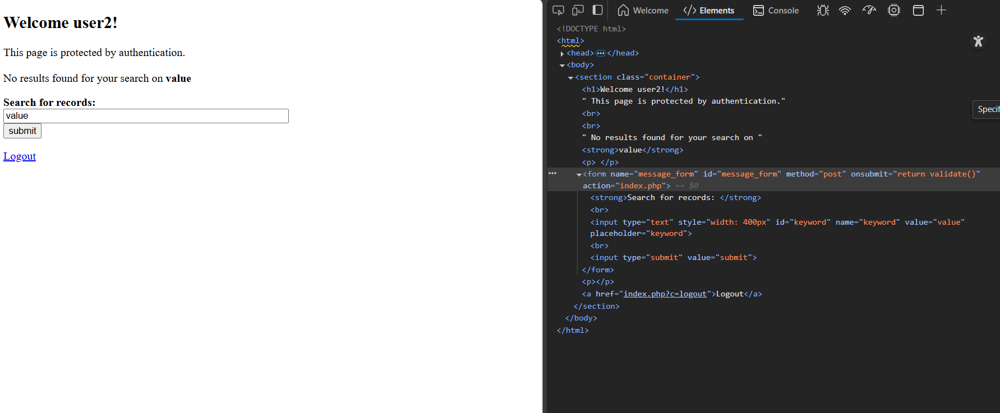
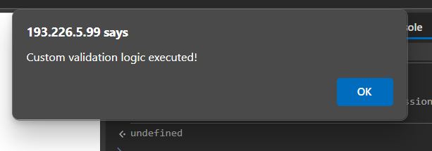
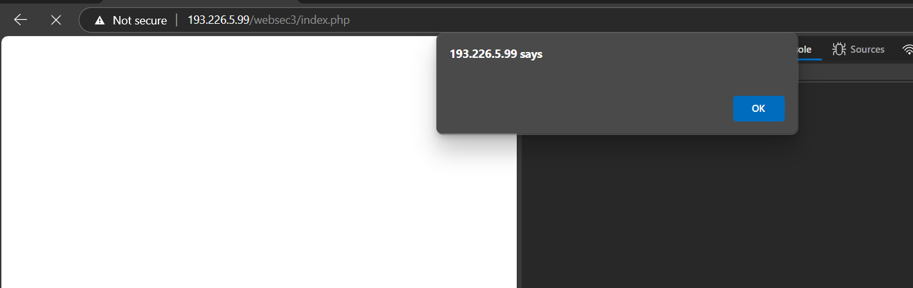
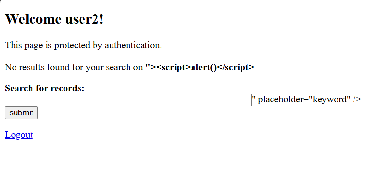

# Cross-site scripting (XSS)
##  Exercise — Session Hijacking
- URL: http://193.226.5.99/websec3/
- Authentication:
    - user: user2
    - password: parola1234
- Exercise:
    - Identify XSS vulnerability
    - Inject a script (payload) that exploits the identified vulnerability
    - Lure the administrator on your page to launch the attack
    - Exfiltrate the session token from the user
    - Authenticate in the attacked application using the session token

<br>First, the value from the input is placed into the value attribute form the input field
<br>For example, when typing `value` and submit, the page looks like this:


<br>I suspect that I am able to insert via the input field an html element or a new attribute for the input.
``` 
" onerror='alert("injected script")'
value" onerror='alert("injected script")'
```
<br>For this kind of input, the browser throws a popup this the message `Invalid search term !`

### Override the `validate()` function
In browser console, I typed `allow pasting`

Then I wrote in console the new `validate()` function that I want to execute
``` 
function validate() {
    return true; // Always allow the form submission
}
```
Then, I want to show an alert to the user, so in the search field, I type
``` 
"><script>alert()</script>
```








So this approach can work to inject anything else

I want to inject a script thta gives me the session token:
[Inspiration from lab 3](./WS3_%20XSS%20_%20CSRF.pdf)

```"><script>alert(document.cookie)</script>```

A scenario would be the following:
- Condition
    - both attacker and victim need to be in the same network (it will be the UTCN one)
- Attacker part
    - Log into the websec3 app
    - Craft a server that logs the session cookie of a user that is an admin (it can be found [here](./server.html), it's an html file) (localhost may be replaced with the actual ip of the local server)
    - Then to run it, just insert the following command into a terminal that is in the same directory as the html file: `python -m http.server`
    - Send the url of the server to the victim
- Victim part
    - Access the attacker's local server from browser
    - press `Send POST Request` button
    - Needs to log into the app
- Attacker part (again)
    - once the victim is logged, search for logs into the local server
    - find his session id, then put it into the browser cookies
    - reload - you should have been stolen the session id from the victim