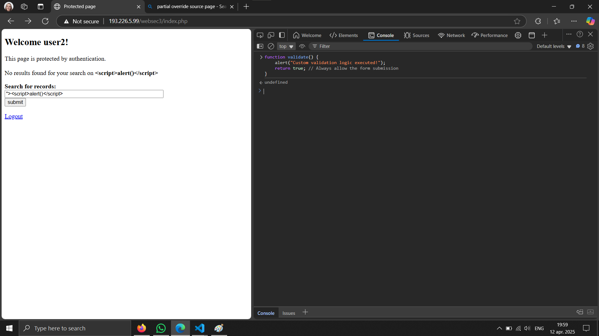

# Cross-site scripting (XSS)
##  Exercise — Session Hijacking
- URL: http://193.226.5.99/websec3/
- Authentication:
    - user: user2
    - password: parola1234
- Exercise:
    - Identify XSS vulnerability
    - Inject a script (payload) that exploits the identified vulnerability
    - Lure the administrator on your page to launch the attack
    - Exfiltrate the session token from the user
    - Authenticate in the attacked application using the session token

<br>First, the value from the input is placed into the value attribute form the input field
<br>For example, when typing `value` and submit, the page looks like this:


<br>I suspect that I am able to insert via the input field an html element or a new attribute for the input.
``` 
" onerror='alert("injected script")'
value" onerror='alert("injected script")'
```
<br>For this kind of input, the browser throws a popup this the message `Invalid search term !`

### Override the `validate()` function
In browser console, I typed `allow pasting`

Then I wrote in console the new `validate()` function that I want to execute
``` 
function validate() {
    alert("Custom validation logic executed!");
    return true; // Always allow the form submission
}
```
Then, I want to show an alert to the user, so in the search field, I type
``` 
"><script>alert()</script>
```




So this approach can work to inject anything else
