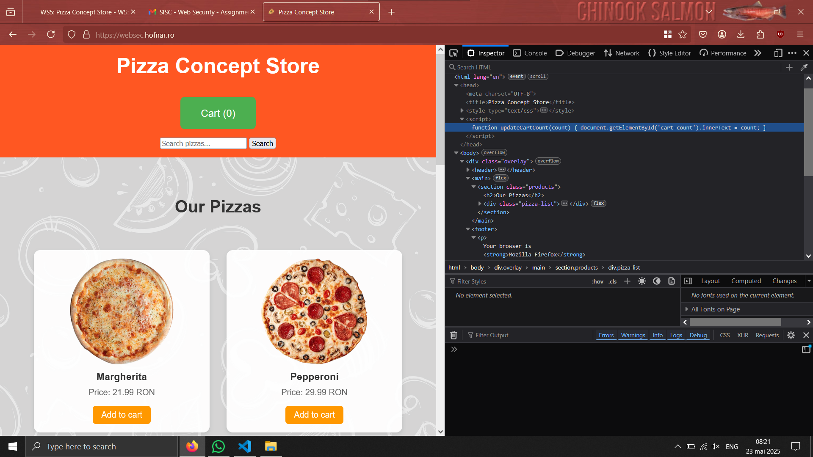
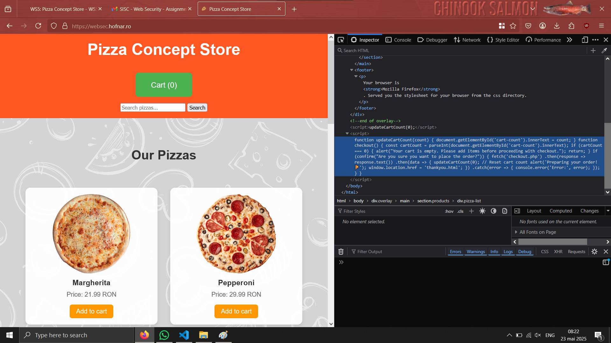
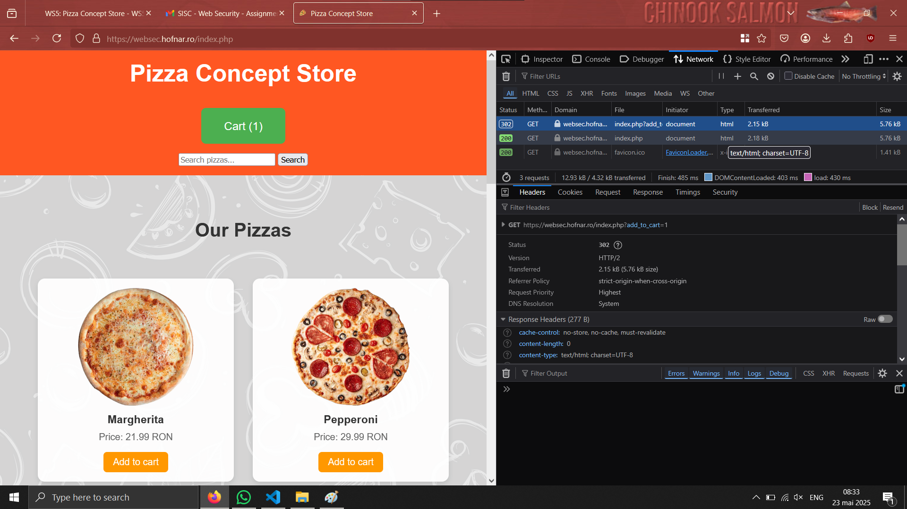
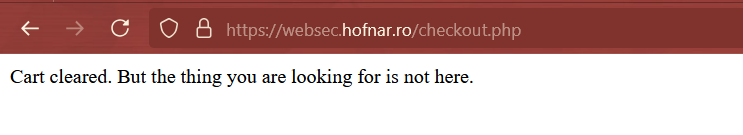
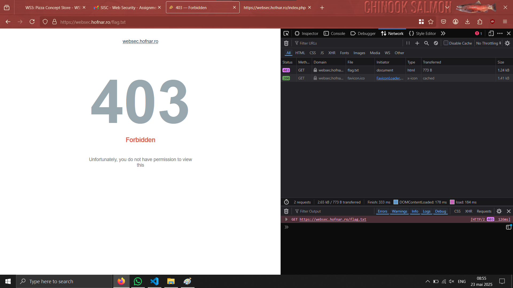
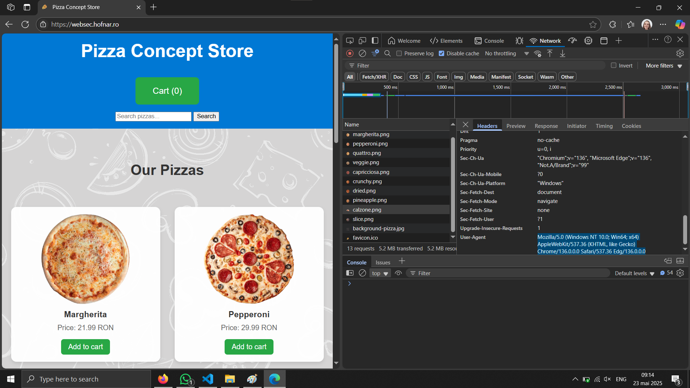
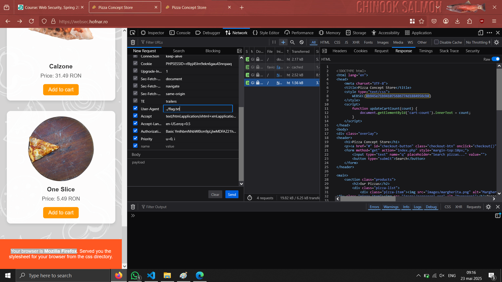

# WS5: Pizza Concept Store

## Assignment
Your assignment is to visit the store at https://websec.hofnar.ro/ and uncover the hidden vulnerability.
Explore the site and interact with its features. The goal is to find the flag hidden somewhere in the application. You’ll know it when you see it.
Your credentials have been sent to the email address you've declared in Moodle.
Make sure to also check your spam/junk folder.
Find the flag and submit it via Moodle, together with a short description of how you found the flag.
Good luck and don't trust everything you see on the surface!

|url|username|password|
|-|-|-|
|https://websec.hofnar.ro/|biancamitroi.2001@gmail.com|v0\^9JHW4ME\^7|

## What I've discovered
- In the DOM there are some scripts in plaintext that manage the business logic of the application


```
        function updateCartCount(count) {
            document.getElementById('cart-count').innerText = count;
        }
 ```

```

    function updateCartCount(count) {
        document.getElementById('cart-count').innerText = count;
    }

    function checkout() {
    const cartCount = parseInt(document.getElementById('cart-count').innerText);

    if (cartCount === 0) {
        alert("Your cart is empty. Please add items before proceeding with checkout.");
        return;
    }

    if (confirm("Are you sure you want to place the order?")) {

        fetch('checkout.php')
        .then(response => response.text())
        .then(data => {
            updateCartCount(0);  // Reset cart count
            alert('Preparing your order! 🍕');
            window.location.href = 'thankyou.html';
        })
        .catch(error => {
            console.error('Error:', error);
        });
    }
}
```
- When adding a Margherita pizza to the cart, the request is made in this way



``` GET https://websec.hofnar.ro/index.php?add_to_cart=1 ```

- When I'm placing the order: GET https://websec.hofnar.ro/checkout.php

- If I want to add something to the cart and I navigate to checkout page



- For this url: https://websec.hofnar.ro/flag.txt, I receive



- The page aspect is based on the browser that you use. For Edge the appearance is different


The browser that is used is collected from User-Agent header parameter form the request



So I'm trying to put something else into that param and see what I get. I will edit and resend the request.



Actually the last item discovered was the relevant one for completing the lab assignment :))))