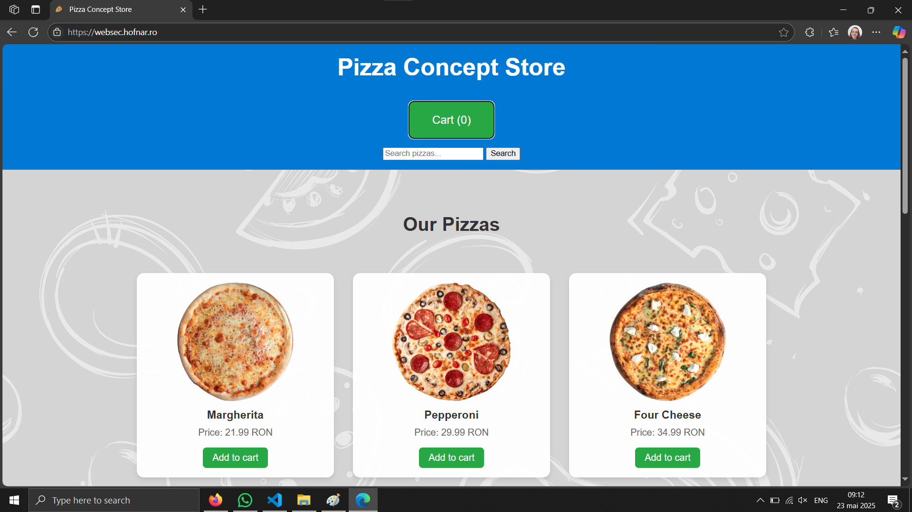

# WS5: Pizza Concept Store

## Assignment
Your assignment is to visit the store at https://websec.hofnar.ro/ and uncover the hidden vulnerability.
Explore the site and interact with its features. The goal is to find the flag hidden somewhere in the application. You’ll know it when you see it.
Your credentials have been sent to the email address you've declared in Moodle.
Make sure to also check your spam/junk folder.
Find the flag and submit it via Moodle, together with a short description of how you found the flag.
Good luck and don't trust everything you see on the surface!

|url|username|password|
|-|-|-|
|https://websec.hofnar.ro/|biancamitroi.2001@gmail.com|v0\^9JHW4ME\^7|

## What I've discovered

- For this url: https://websec.hofnar.ro/flag.txt, I receive

- The page aspect is based on the browser that you use. For Edge the appearance is different

The browser that is used is collected from User-Agent header parameter form the request

So I'm trying to put something else into that param and see what I get. I will edit and resend the request.

Actually the last item discovered was the relevant one for completing the lab assignment :))))